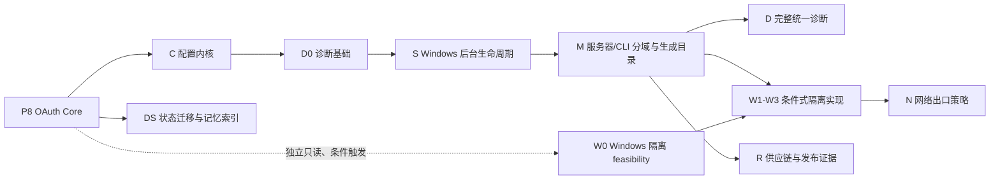

# CodexGPT Phase 8 后项目改进实施计划

**状态：** Proposed；仅完成设计，未获运行时实施授权
**日期：** 2026-07-26
**输入：** [Phase 8 规格](../specs/2026-07-24-phase-8-oauth-and-public-auth-design.md)、[Phase 8 TDD 计划](2026-07-24-phase-8-oauth-and-public-auth.md)、[`openai/codex` 对标审阅](../../reviews/2026-07-26-openai-codex-project-review.md)
**产品目标排序：** 可运行 > 实用性 > 便捷
**不可交换约束：** 授权边界、安全失败关闭、审计和可回滚性不能用来换取便捷；维护性服务于前三项目标，而不是单独压过用户价值。

## 1. 执行结论

不要同时开启所有改进。推荐的最短用户价值路径是：

```text
Phase 8 OAuth
  -> 配置可解释
  -> 诊断基础
  -> 后台运行
  -> 服务器/CLI 分域
  -> 完整统一诊断
  -> 按测量结果决定状态库、发布

如果用户明确提出运行不受信任代码，再并行做 Windows 隔离只读 feasibility；
只有 feasibility 证明可行后，才考虑实现隔离和网络出口。
```

严格依赖关系如下：



允许并行的是独立设计或只读 feasibility；同一运行时边界一次只合入一个工作包。任何工作包都不得借机扩大远程权限、改变工具合同、安装未批准依赖或发布。

## 2. 通用实施规则

每个工作包都按以下顺序执行：

1. **授权门：** 明确本次允许修改的文件、依赖、系统状态和外部状态。
2. **基线门：** 记录精确 HEAD、Git 状态、工具链、当前合同数和最窄测试。
3. **RED：** 先写能证明用户旅程、失败关闭和兼容性的失败测试。
4. **GREEN：** 只实现当前测试需要的最小能力。
5. **对抗审查：** 功能初版完成后，再做安全、UX、并发、恢复和依赖审查。
6. **本地门：** focused test、build/typecheck、相关 smoke、`git diff --check`、secret scan、`npm run policy:check`。
7. **双主版本门：** 平台或运行时相关改动使用托管 Node 20/24；ordinary 走 detached runner。
8. **真实用户门：** 改变 ChatGPT、Windows 或 Cloudflare 用户流程时，必须有对应真实环境证据。
9. **文档/记忆门：** 更新用户文档、配套规格、根 Memory 和追加式 archive。
10. **发布门：** 只有 closure SHA 的 exact-head CI 全绿才可关闭；发布、部署、push 仍需单独授权。

所有用户错误遵循一个格式：

```text
发生了什么
系统已经安全地做了什么
用户下一步只需运行哪一条命令
如何查看详细证据
```

## 3. 工作包 P8 — OAuth Core

**来源：** [Phase 8 规格](../specs/2026-07-24-phase-8-oauth-and-public-auth-design.md)和[可执行 TDD 计划](2026-07-24-phase-8-oauth-and-public-auth.md)是唯一控制文档。本文不重复完整任务。

### 目标

把 ChatGPT 连接从查询参数静态 token 迁移为 OAuth 2.1 + PKCE S256，同时保持单用户、自托管、本地审批和 Cloudflare 仅做 DNS/TLS/Tunnel。服务端可用一次重启切换模式；ChatGPT 客户端回滚依赖迁移期间分别保留 Legacy App 与 OAuth App。

### 最短用户旅程

已发布的全局安装只需运行：

```powershell
codexgpt auth setup --root D:\Dev\target-repo --hostname mcp.example.com --tunnel-name codexgpt-oauth
```

未发布的源码 checkout 使用：

```powershell
node D:\Dev\codexgpt\scripts\codexgpt-entry.mjs auth setup --root D:\Dev\target-repo --hostname mcp.example.com --tunnel-name codexgpt-oauth
```

交互式成功后，`auth setup` 保持已验证候选为前台服务，因此不再要求第二条 `start`。只有显式 `--no-start` 或非交互模式才打印一条带精确 `--root` 的 source/global 启动命令。

首次在 ChatGPT 添加 App 时，本地终端显示一次相关码和作用域，用户执行：

```powershell
codexgpt auth approve <correlation-code>
```

此后访问令牌自动刷新；正常启动不再复制含凭据 URL。

### G8 前置门

- 当前设计/审阅授权不等于运行时授权。
- 重新确认 Node 20/24、MCP SDK、`jose`、Apps SDK auth 文档、MCP authorization spec 和真实 ChatGPT 回调格式。
- 依赖变更、DPAPI disposable credential、Cloudflare 外部状态和真实 ChatGPT 测试分别获得授权。

### 必须通过

- 项目自有严格 DCR 与元数据；SDK 根路由只复用 `/authorize`、`/token`、`/revoke`。
- exact issuer/resource、PKCE S256、短期 ES256 access JWT、旋转 opaque refresh、即时 grant revision。
- 每个 refresh family 串行事务；获锁后权威重读；具体存储固定到生命周期。
- public、OAuth 和 local admin 监听器边界分离。
- `legacy|oauth` 精确模式，V1–V5 保持 28/31/39/51/52，不新增工具。
- G8-U 真实 ChatGPT App UI、restart、revoke、rollback 和 exact-head CI。

### 回滚

`auth rollback --root D:\Dev\target-repo` 只把所选 profile 切到 `legacy`；前台进程需先停止再用打印的精确命令启动。只有后来单独实施了工作包 S，后台模式才执行 `service restart --root D:\Dev\target-repo`。随后在 ChatGPT 使用迁移期间保留的 Legacy App，而不是期待 OAuth App 自动变成 Legacy App。返回 OAuth 时重新运行幂等的 `auth setup --root D:\Dev\target-repo`；它从已保存的 hostname/tunnel 推断参数，重新执行候选探测并原子切回 `oauth`，然后使用保留的 OAuth App。两条路径都不删除 key、grant、audit、profile 或 Cloudflare 状态；已撤销 grant 不因模式往返而复活。

### 兼容期后的旧凭据退出

Phase 8 Core 不删除旧 query token。至少完成一个兼容周期、真实 rollback/return 证据和独立授权后，才新增 `auth legacy status --root ...`、有期限迁移警告和 owner 明确确认的删除命令。删除前再次证明 OAuth App、Legacy App、回滚和恢复边界；永不因“OAuth 已启用”自动清理旧凭据。

## 4. 工作包 C — 可解释配置内核

**优先级：** P1
**预计规模：** M，建议 4–6 个独立 STEP
**用户价值：** 每个配置问题都能回答“有效值是什么、来自哪里、怎么修”

### C0 — 授权与基线

允许范围建议：

- 新增纯配置 schema/resolver 模块与测试；
- 分步迁移 `src/config.ts`、`src/profileStore.ts`、`scripts/doctor.mjs`；
- 不改变默认权限、网络边界或现有 profile 值；
- 不一次性删除兼容环境变量。

记录：

- 所有 CLI、环境变量、profile 和默认来源；
- 冲突优先级；
- 当前无效值、未知字段和弃用键行为；
- doctor 与 start 的行为差异。

### C1 — RED：配置合同

新增表驱动测试：

- 有对应 selector 的 CLI > current-process 环境 > persisted-user 环境 > canonical-root profile > default；
- 兼容旧键只在新键缺失时生效；
- 同层重复/冲突失败并指出来源；
- profile 未知字段失败并给出最相近建议；
- 无效 enum、范围、路径和组合包含 JSON path/环境变量名；
- secret 的诊断只显示 `set|missing` 与来源，不显示值或摘要；
- Windows 环境变量大小写、空字符串、Unicode 路径和尾随空格；
- `doctor` 与 `start` 对同一输入生成同一有效配置指纹；
- `--no-profile` 跳过所有 profile 读取和校验。

### C2 — GREEN：纯 resolver

建立以下窄接口，命名可在实现时调整：

```ts
type ConfigOrigin =
  | { kind: "cli"; argument: string }
  | { kind: "environment"; variable: string; scope: "current-process" | "persisted-user" }
  | { kind: "profile"; file: string; jsonPath: string }
  | { kind: "default"; rule: string }
  | { kind: "compatibility"; source: string; removeAfter: string };

type ResolvedValue<T> = {
  value: T;
  origin: ConfigOrigin;
  restartRequired: boolean;
};

type ResolvedConfig = {
  effective: CodexGPTConfig;
  origins: ReadonlyMap<string, ConfigOrigin>;
  publicFingerprint: string;
  diagnostics: readonly ConfigDiagnostic[];
};
```

要求：

- 解析器是纯函数，显式接收 argv/env/profile/platform/cwd；
- 只有上层 loader 访问文件系统和 `process.env`；
- 指纹基于去密后的规范序列化，排序固定；
- 解析错误有稳定代码，用户文本和机器 JSON 分离；
- Phase 8 的 issuer/resource/auth mode 先使用同一来源模型。

### C3 — 严格 profile schema

- 用当前已有验证栈生成 JSON schema，不因本工作包引入第二套 schema 框架。
- 顶层和嵌套对象默认拒绝未知字段；明确保留的扩展区除外。
- profile 加 schema version；新二进制可把旧 schema 复制迁移到候选文件并原子替换，旧二进制遇到未来 schema 必须拒绝写入，不能丢弃未知字段或以旧格式覆盖。
- canonical root 是 profile 的主选择器；在项目尚无已验证命名 profile resolver 前，公共命令统一使用 `--root <canonical-path>`，不设计无法落地的 `--profile <name>` 快捷方式。
- 兼容层必须证明新二进制可读旧 profile、旧二进制能对未来 schema 安全拒绝、切回旧 resolver 后原文件和值仍完整。
- 写 profile 使用现有原子应用状态后端，保留备份和失败注入。

### C4 — 统一 doctor/start

新增：

```powershell
codexgpt config explain --root D:\Dev\target-repo
codexgpt config explain auth.mode --root D:\Dev\target-repo
codexgpt doctor --root D:\Dev\target-repo --json
```

输出示例：

```text
auth.mode = oauth
source    = profile D:\...\profiles\default.json $.auth.mode
effective = after restart
next      = press Ctrl+C in the foreground server, then run:
            codexgpt start --root D:\Dev\target-repo
```

只有工作包 S 已安装时，后台模式的同一诊断才打印 `codexgpt service restart --root D:\Dev\target-repo`；否则始终打印前台 stop/start。doctor 直接消费 `ResolvedConfig`，不得自己再读 JSON 或重做优先级。

### C5 — 迁移与兼容

- 一次迁移一组设置：网络/auth → workspace/security → shell → analysis/guidance。
- 每组保留旧输入一个迁移期，发结构化弃用提示。
- 兼容期结束必须单独授权；不得在普通功能提交中顺带删除。

### C 验收

- 所有旧有效配置在合同夹具中解析等价；
- 未知/冲突配置失败信息能给一条修复命令；
- doctor/start/setup 使用同一配置对象和指纹；
- secret scan 证明解释输出、JSON、日志和测试快照没有凭据；
- V1–V5、公开网络与权限默认值不变。

### C 回滚

保留旧 loader behind `CODEXGPT_CONFIG_RESOLVER=legacy|standard` 一个迁移期；回滚只切 resolver，前台停止后用精确 `start --root` 命令重启，后台使用精确 `service restart --root`，不改 profile 文件。未来 schema 或无法无损表示的字段始终拒绝写入，不能为了回滚静默降级。

## 5. 工作包 S — Windows 后台生命周期

**优先级：** P1
**预计规模：** M
**依赖：** Phase 8 start/auth/profile 合同稳定
**用户价值：** 开机/登录后连接自动恢复，不再保留终端窗口

### S0 — 授权和选择

默认选择当前用户 Task Scheduler，而不是 Windows Service：

- 不要求管理员权限；
- 不保存用户密码；
- 仅在用户登录时运行；
- 使用隐藏窗口；
- 更符合个人自托管范围。

若需求变成“未登录也运行”，必须重新设计凭据边界和服务账户，不在本工作包推断。

### S1 — RED：生命周期合同

测试：

- `install --dry-run` 只输出精确任务定义，不写系统；
- 安装绑定受支持 public entry、精确 `process.execPath`/托管 Node、canonical root、cwd、状态目录、入口/配置 digest 和版本；
- 任一路径不存在、指向非托管二进制或被替换时失败；
- 重复安装幂等；配置变化显示 diff；
- 启动健康检查有超时、重试和安全错误；
- `start|stop|restart` 只控制精确拥有的任务实例和完整进程树；
- `uninstall` 不删除 OAuth、audit、profile、Tunnel 或日志；
- 非拥有、名称相似或被篡改的任务拒绝修改；
- 用户注销/登录、机器重启、睡眠唤醒、网络断开恢复和端口占用夹具；
- `legacy` 与 `oauth` 都通过生命周期测试；OAuth 待审批时 status 显示安全计数并指向 `auth open`，不把批准权放进计划任务；
- 前台实例与后台任务争用同一部署锁/端口时失败并给出 `service stop --root ...` 或停止前台进程的唯一行动。

### S2 — 命令面

```powershell
codexgpt service install --root D:\Dev\target-repo [--dry-run]
codexgpt service start --root D:\Dev\target-repo
codexgpt service stop --root D:\Dev\target-repo
codexgpt service status --root D:\Dev\target-repo [--json]
codexgpt service logs --root D:\Dev\target-repo [--follow]
codexgpt service restart --root D:\Dev\target-repo
codexgpt service uninstall --root D:\Dev\target-repo
```

安装交互只有一次确认：

```text
将创建当前用户计划任务 CodexGPT/<root-binding-id>
入口: <exact managed entry>
工作区: <canonical root>
配置: <profile path + security fingerprint>
监听: public 127.0.0.1:8787; admin 127.0.0.1:<ephemeral-or-configured>
不会: 保存 Windows 密码、开放入站端口、删除现有状态
继续? [y/N]
```

### S3 — 拥有权与恢复

- 任务描述包含随机 owner ID、安装 schema、入口 digest 和状态目录引用；
- 控制前重新读取任务 XML/COM 属性并验证拥有权；
- owner marker 只防止误操作，不构成对同一 Windows 用户下恶意进程的安全隔离；
- launcher 固定全局安装或源码 checkout 的精确入口，使用隐藏窗口、正确的 Windows/Unicode quoting，并把 stdout/stderr 写入有界 owner-only 日志；不得依赖交互 shell profile；
- 环境从显式最小白名单构造，保留必要 Windows/Node/配置路径，清除或拒绝非本任务拥有的 `NODE_OPTIONS`，不继承 GitHub、npm、Cloudflare 或其他 ambient token；
- 计划任务不能与现任务并行占用相同锁/端口，因此更新采用短暂停机日志：导出并验证旧 XML → 停止精确拥有的旧任务与进程树 → 注册新定义 → 启动并做本地健康检查 → 失败时恢复旧 XML 并再次验证；
- 连续启动失败保留上一版本定义并停止重启风暴；
- 自动回滚只允许恢复任务 XML/启动 action，且新旧定义的 auth mode、canonical root、hostname、profile、credential/state 位置和安全关键配置指纹完全相同；不得自动回滚代码、OAuth grant、hostname、profile 或凭据；
- `status` 同时报告 Task Scheduler 状态、实际本地 health、cloudflared 子进程、入口/配置 digest 和待审批数量，不能把“任务为 Running”等同于服务可用；
- 日志轮转有大小/时间上限，token/URL query/私有内容脱敏。

### S4 — 用户文档与真实门

真实 Windows 验收：

1. fresh install；
2. ChatGPT 调用成功；
3. 用户登录重启后恢复；
4. OAuth refresh 仍成功；
5. 待审批时 `service status` 给出 `codexgpt auth open --root D:\Dev\target-repo`，本地批准后连接继续；
6. `status`/`logs` 可定位故障；
7. uninstall 后手动 `codexgpt start --root D:\Dev\target-repo` 仍可用。

### S 回滚

恢复上一任务 XML/启动 action 或卸载任务；不声称恢复旧代码版本，并保留全部应用状态。`uninstall` 先停止精确拥有的任务，交互式要求确认，非交互式必须有显式确认 flag。任何自动恢复都不得创建新的 Cloudflare Tunnel/DNS、改变安全指纹或重新签发 owner 凭据。

## 6. 工作包 D — 统一诊断与本地可观测性

**优先级：** P1
**预计规模：** M
**依赖：** 配置来源模型可先局部完成
**用户价值：** 从“连不上”到明确下一步的时间显著缩短

### D1 — 诊断 schema

定义版本化结果：

```ts
type DiagnosticResult = {
  id: string;
  status: "pass" | "warn" | "fail" | "blocked" | "skipped";
  summary: string;
  evidence: Record<string, string | number | boolean>;
  nextCommand?: string;
  sensitiveEvidenceStoredAt?: string;
};
```

稳定检查 ID 至少覆盖：

- config/profile；
- managed Node/cloudflared identity；
- listeners/ports；
- public hostname/DNS/Tunnel；
- Host/Origin；
- OAuth metadata/JWKS/clock/key；
- DCR/client/grant/refresh 状态；
- MCP handshake/tool snapshot；
- workspace/profile/shell/semantic；
- audit/state directory health。

### D2 — correlation

在不改变授权的前提下贯穿：

```text
public request
 -> OAuth pending
 -> local approval
 -> authorization code
 -> access token jti/grant revision
 -> MCP session
 -> workspace handle
 -> audit event
```

公开日志只显示短相关码；完整内部 ID 只在本地受保护诊断中出现。不得把 token、code、refresh、query token、私有 key 或完整文件路径写入公共错误。

### D3 — 用户命令

```powershell
codexgpt doctor --root D:\Dev\target-repo
codexgpt doctor --root D:\Dev\target-repo --json
codexgpt diagnostics bundle --root D:\Dev\target-repo --output <path>
codexgpt diagnostics inspect <bundle>
```

`doctor` 与 `inspect` 必须能在主服务启动失败时离线只读运行。它们不取得 writer/admin 权限，不自动修复 auth、profile、Tunnel、任务或状态；需要修复时只打印显式命令。

bundle 默认：

- 先展示将包含/排除的类别；
- 通过已审查的安全状态根/ACL helper 写入 owner-only 目录，验证 owner DACL，拒绝 symlink/junction/reparse point，并在打开句柄后复查稳定身份；
- 使用 manifest、每文件 digest、大小/时间上限；
- 脱敏后再落盘；
- 不自动上传、不启动网络；
- 完成后给出保留期限和显式删除命令；
- `inspect` 只报告“已知 secret/path 模式扫描无命中”以及无法判定的类别；它不能证明任意私有内容都不存在。

diagnostic、日志、安全错误与 bundle 共用一个版本化 redaction taxonomy 和攻击夹具，但 redaction 不能替代 secret-path 写入阻断、授权或内容最小化。

### D4 — 指标与 tracing

仅本地、低基数：

- 请求/授权/工具延迟分桶；
- 安全错误代码计数；
- refresh lock 等待/重放；
- transaction/recovery；
- background restart；
- queue/backpressure。

远程 exporter 保持未实现或显式关闭。将来启用必须单独说明数据字段、目的地、保留和用户关闭方式。

### D 验收

- 故障夹具对每个主要层给唯一主行动；
- `--json` schema 有兼容测试；
- bundle secret/path/内容泄漏攻击测试通过；
- tracing 关闭时接近零用户可见开销；
- 离线诊断在损坏/锁定/主服务不可用时仍保持只读并给出唯一下一步；
- 诊断失败不能改变 auth、workspace、Tunnel、计划任务或系统状态。

### D 回滚

关闭新诊断 sink，不影响现有审计；保留旧 doctor wrapper 一个迁移期。

## 7. 工作包 M — 服务器/CLI 分域与生成式工具目录

**优先级：** P1
**预计规模：** L，必须拆为多个可独立关闭的 STEP
**依赖：** Phase 8 边界稳定；配置/诊断接口至少有窄版本
**用户价值：** 后续功能更快、更少回归，ChatGPT 工具说明与实际权限一致

### M0 — 禁止“大重写”

先锁定：

- V1/V2/V3/V4/V5 = 28/31/39/51/52；
- 所有 tool descriptor、schema、annotations、security schemes 和可见性；
- `registerToolCompat` 行为；
- connection-test 隐藏规则；
- approval/policy/audit 包装顺序；
- CLI stdout/stderr/exit code 快照；
- public/OAuth/admin 路由表。

没有这些特征测试，不开始移动代码。

### M1 — canonical tool catalog

建议模型：

```ts
type ToolManifestEntry = {
  name: string;
  introducedIn: 1 | 2 | 3 | 4 | 5;
  capability: "read" | "write" | "execute";
  toolModes: readonly ("minimal" | "standard" | "full")[];
  connectionTestVisible: boolean;
  authModes: readonly ("legacy" | "oauth")[];
  guidanceModes: readonly ("legacy" | "standard")[];
  inputSchema: ZodRawShape;
  outputSchema?: ZodRawShape;
  annotations: Readonly<Record<string, unknown>>;
  approvalClass: string;
  securitySchemes: readonly SecurityScheme[];
};

type ToolHandlerRegistry = ReadonlyMap<
  ToolManifestEntry["name"],
  (deps: ToolDomainDependencies) => ToolHandler
>;
```

`ToolManifestEntry` 是无副作用纯数据；生成器不得导入 handler、composition root 或会访问环境/文件系统的模块。CI 分别证明 manifest 名称与 `ToolHandlerRegistry` 一一对应、合同版本与 tool mode 是不同维度、connection-test/auth/guidance 可见性没有被压成一个含糊数组。

生成：

- MCP 注册 descriptor；
- V1–V5 精确清单；
- schema/digest fixtures；
- README/README_ZH 工具表；
- security scheme 检查输入；
- 缓存 tool snapshot 变化说明。

不生成或不委托：

- 实际授权判断；
- workspace resolution；
- approval grant；
- transaction 二次检查；
- audit enforcement。

这些仍由服务端独立执行，catalog 只是声明。

### M2 — 按域提取 `server.ts`

建议顺序从低风险到高风险：

1. resource/widget/connection-test；
2. read/search/context/guidance；
3. semantic；
4. workspace lifecycle；
5. filesystem transaction；
6. Git/worktree；
7. shell/execute；
8. composition root。

每一步：

- 只移动一个域；
- 不改公开名称、schema、错误、策略或执行顺序；
- 运行该域 focused tests + 全合同；
- 比较生成 catalog digest；
- `git diff --check` 和 policy。

### M3 — 分离 HTTP composition roots

目标结构示意：

```text
src/http/
  publicResourceServer.ts
  oauthAuthorizationServer.ts
  localAdminServer.ts
  hostOriginPolicy.ts
  safeErrors.ts
  composition.ts
```

要求：

- public、OAuth、admin 分别有路由清单与负面清单；
- 共享业务服务，不共享隐式 middleware 状态；
- public 永远不能路由到 admin；
- CORS 不作为授权；
- AsyncLocalStorage identity 在协议边界创建，在 handler 深处只读取。

### M4 — 分离公共 CLI

目标结构示意：

```text
scripts/cli/
  start.mjs
  auth.mjs
  cloudflare.mjs
  doctor.mjs
  profile.mjs
  service.mjs
  output.mjs
scripts/codexgpt-entry.mjs
```

entry 只负责：

- 早期安全环境；
- 参数解析/命令调度；
- 统一错误和退出码；
- 公共入口保护。

不得把 `scripts/codexgpt.mjs` 直接调用恢复成受支持路径。

### M 验收

- 公开工具、路由、CLI、exit code 和安全错误合同不变；
- `server.ts` 成为组合根而非业务逻辑仓库；不设武断行数目标，以域依赖方向和测试隔离为准；
- 生成物可重建、无 diff；
- 未分类工具/路由加入会在 CI 失败；
- Node 20/24、Ubuntu/Windows、真实 ChatGPT smoke 不回退。

### M 回滚

每个域保持独立提交和兼容 facade；回滚一个域不影响其他已提取域。不得通过保留两套可写 handler 长期“双运行”来回滚。

## 8. 工作包 W — Windows 原生执行/沙箱 feasibility

**优先级：** P2/条件触发；W0 只读 feasibility 可独立授权，W1–W3 只有明确的不受信任代码执行需求才进入
**预计规模：** L/高风险
**依赖：** W0 依赖现有 Phase 4 边界；任何实现还依赖配置、诊断、模块化接口稳定，以及独立依赖/许可证/系统状态授权
**用户价值：** 有机会把当前 V3 + `full_access` 已有的原生 PowerShell/进程能力限制到真实 workspace；它不是“新增 PowerShell”

### W0 — 第一阶段只做只读/隔离 spike

W0 可以在 Phase 8 后独立并行，但只读取上游源码、许可证和本机能力，不安装 binary、不创建账户/ACL/WFP/服务、不修改运行时。比较三个候选：

1. 分开评估固定版本的 `openai/codex` Windows sandbox、process host 与 IPC 设计；
2. 只复用协议/威胁模型，自建最窄 sandbox broker + process host；
3. 维持 `workspace` 不可用，继续 `full_access` 诚实模式。

`exec-server` 是进程/输出协议组件，不是沙箱，不能单独作为 workspace isolation 证据。候选硬性禁止 `--remote`、OpenAI registry/relay/auth、未认证 TCP/WebSocket listener 或 Cloudflare 公网入口；只允许项目拥有的 stdio、ACL 约束 named pipe，或具有项目自有双向认证与 exact-loopback 绑定的 IPC。

评分维度：

- Apache-2.0/NOTICE/分发；
- 固定上游 SHA/发布版本、协议稳定、精确构建复现、传递许可证/NOTICE、构建和签名；
- Windows 10/11 版本与家庭版可用性；
- 文件 ACL/令牌/Job/进程树/ConPTY；
- DPAPI 与提权通信；
- WFP/网络；
- 状态目录和升级；
- 协议输入是否允许远端选择命令/路径；
- 故障时是否可证明失败关闭；
- Node 20/24 适配和包体积。

若候选需要创建特权账户、放宽 ACL、安装 WFP 规则或提权 helper，W0 只记录完整创建/升级/崩溃恢复/清理协议并给出 no-go；不得在 feasibility 中试装。

### W1 — 威胁矩阵与验收攻击

必须覆盖：

- `..`、junction、symlink、hardlink、ADS、device、UNC、drive-relative；
- 进程逃逸、孙进程、句柄继承、命名管道、COM、注册表；
- 用户 profile、SSH/Git/cloud/浏览器凭据；
- loopback/private/metadata/DNS rebinding；
- shell profile、startup、PowerShell module/autoload；
- executable replacement 与签名/摘要；
- broker/native host 崩溃、超时、重启、版本不匹配；
- audit 丢失和 partial grant。

### W2 — 最窄协议适配

只有用户再次明确授权“不受信任代码执行”、W0 得到 go、且 C/D/M 提供稳定边界后才进入。远端只能选择项目定义的操作联合，不传原生 sandbox flags。服务器负责：

- 解析 workspace handle；
- 绑定 approval、profile、root、command digest 和输入；
- 构造 native request；
- 验证有序输出、退出、进程树终止和审计；
- 输出事实字段：

```text
execution_isolation
filesystem_isolation
network_isolation
native_backend_version
evidence_revision
```

### W3 — 激活门

只有全部满足才可让 `workspace` 可用：

- 独立 native control harness 攻击测试通过；
- 普通 connector 测试不执行破坏性所有权操作；
- 丢失/矛盾证据失败关闭；
- 没有回退到 `full_access`；
- 真实 PowerShell、Git Bash optional 和常见工具可用；
- 受支持 Windows 版本矩阵通过；
- 用户旅程不超过：选 profile → 看一次边界 → 审批命令。

### W 回滚

关闭 native backend feature，`workspace` 回到 unavailable；保留 `full_access` 的现有明确选择。不得把失败后端静默映射为 full access。

## 9. 工作包 DS — 状态迁移与记忆索引

**优先级：** P2
**预计规模：** S（接口/索引）+ 可选 M（SQLite spike）
**用户价值：** 升级可恢复、历史可快速定位

### DS1 — 状态接口和版本

为 auth/application state 统一定义：

- schema version；
- reader/writer capability；
- lock/revision；
- atomic replace；
- backup manifest；
- corruption classification；
- migration transaction；
- downgrade behavior。

Phase 8 JSON/DPAPI 实现先满足接口，不改变存储引擎。

### DS2 — 测量门

采集本地安全指标：

- records/bytes；
- writes/day；
- p50/p95 写延迟；
- refresh contention；
- startup/recovery time；
- backup count/size；
- 查询需求。

仅当任一条件持续达到阈值才启动 SQLite spike，例如：

- 单文件状态超过 10 MB；
- p95 原子写超过 100 ms；
- 需要跨表查询而全量扫描显著影响用户；
- 并发锁冲突成为真实故障。

阈值须由测试机器与真实数据校准，不作为当前事实。

### DS3 — SQLite spike（条件触发）

- Node 20/24、Windows/Ubuntu 的驱动与打包；
- WAL、busy timeout、迁移 checksum；
- 新 binary 打开旧 DB；
- 旧 binary 面对新 schema 安全拒绝/只读；
- corruption 只备份精确 DB 与 sidecars；
- 导出回 JSON 的恢复工具；
- DPAPI protected field 不以明文进入 DB/WAL/backup。

### DS4 — 记忆索引

生成而不重写 archive：

```powershell
npm run memory:index
npm run memory:check
npm run memory:find -- "G8-U"
```

索引字段：STEP、phase、date、status、SHA、run ID、title、source file、line anchor。记录键使用 `source file + STEP`，同时生成全局 STEP 冲突报告；CI 冻结并报告既有 Phase 6/7 历史重叠，但只阻止当前基线之后新增的重复或倒退，不重写追加式 archive。它还检查可重建、断链和根 Memory 大小。

### DS 回滚

删除可重建索引即可；状态迁移保留旧格式导出和显式 rollback 工具，不自动删除旧备份。

## 10. 工作包 R — 供应链与发布证据

**优先级：** P2
**预计规模：** M
**依赖：** 用户明确发布形态（npm source checkout、打包 CLI 或二者）
**用户价值：** 知道安装的内容对应哪次验证，可安全升级/回退

### R1 — 依赖变更门

自动化输出：

- direct/transitive version diff；
- license diff；
- install scripts/native binary diff；
- public API/type diff；
- MCP route/metadata/tool descriptor/schema diff；
- Node 20/24 install/build/smoke；
- known vulnerability 与项目是否真正可达。

MCP SDK、`jose`、Cloudflare installer 和 native backend 为高风险依赖，升级必须有专门合同。

### R2 — 发布物

每个正式发布生成：

- 精确 source SHA；
- package content manifest/digests；
- SBOM；
- Node/OS support；
- exact-head CI run；
- tool contract version/digest；
- config schema version；
- state schema version；
- known limitations/rollback；
- provenance/signature（在发布平台支持时）。

### R3 — 解析器属性测试

Phase 8 已把 OAuth URL/query/form/JSON 的 fixed-seed 属性/对抗边界放进 G8；R3 不重复其 Core closure，而是在有运行数据和稳定 parser API 后扩展到跨域、长时间 fuzz。优先目标：

- OAuth URL/query/form/JSON；
- Host/Origin/redirect/resource；
- Windows path；
- profile/config；
- MCP tool union；
- archive/index parser。

属性：

- parser 不崩溃；
- bounded time/memory；
- duplicate/ambiguous input 失败；
- normalize 后再验证；
- error 不回显 secret；
- parse/serialize round-trip 只对允许值成立。

### R4 — blocking gate

所有新增检查必须汇总到一个明确的 blocking CI job；不能只显示绿色但不阻止 closure。文档-only 与 runtime matrix 继续分类，避免浪费完整矩阵。

### R 回滚

自动化本身可关闭，但不能删除已发布 provenance/SBOM。依赖升级按独立提交回滚，不修改用户状态。

## 11. 工作包 N — 网络出口策略

**优先级：** P2/条件触发
**预计规模：** L/高风险
**前置：** W 工作包证明 OS 级后端能阻止代理绕过
**用户价值：** 受限命令可访问明确外部服务，而非拥有任意网络

### N0 — 非目标

- 不通过 `HTTP_PROXY` 环境变量声称网络隔离；
- 不把 Cloudflare 入站 Tunnel 当作出站策略；
- 不允许远程请求临时扩大 allowlist；
- 不记录完整 URL query/header/body。

### N1 — 策略模型

```text
deny wins
default deny
exact scheme + host + port
bounded DNS resolution
block loopback/private/link-local/metadata
method and byte limits
audit rule id + destination class + result
```

### N2 — 执行

- proxy 只监听随机 loopback；
- native backend 强制受限进程只能到 proxy；
- DNS 在策略层解析并绑定，防重绑定；
- TLS 验证不能关闭；
- proxy/审计不可用时受限执行失败；
- 用户批准的是命令摘要 + 目标规则集合，不是任意 URL。

### N3 — 验收

攻击测试覆盖直连 IP、IPv6、DNS rebinding、CONNECT、代理变量覆盖、子进程、UDP/QUIC、localhost、云 metadata 和编码绕过。

### N 回滚

禁用联网 profile，受限命令回到无网络；不得回到任意直连。

## 12. 推荐排期与停止点

不使用日历承诺，用可验证停止点：

| 波次 | 内容 | 可停止交付 |
|---|---|---|
| Wave 1 | P8 OAuth | ChatGPT 标准登录、刷新、撤销、legacy 回滚 |
| Wave 2 | C 配置内核 + D 诊断基础 | 一条命令解释配置和连接失败 |
| Wave 3 | S 后台生命周期 | Windows 登录后自动恢复、统一状态/日志 |
| Wave 4 | M 生成目录/分域 + D 完整诊断 | 协议单一事实源、核心单体逐域缩小、端到端故障定位 |
| Wave 5 | 条件式 W0 只读 feasibility | 仅在不受信任执行需求出现时给明确 go/no-go；不以代码量冒充可用沙箱 |
| Wave 6 | DS/R | 按测量补状态迁移、索引、发布证据 |
| Wave 7 | 条件式 W1–W3；成功后才有 N | 真实 workspace isolation；仅在不可绕过的 OS 隔离成立后实施网络出口 |

每个 Wave 完成后可以停止，现有功能仍可运行。若用户只追求近期日常便利，Wave 1–3 的价值最高；Wave 4–7 不应阻塞 OAuth 与后台使用。W0 的只读研究可在 Phase 8 后与 C/D/S 并行，但不改变主交付顺序；W1–W3 不能早于 C/D/M 的稳定接口。

## 13. 项目级成功指标

这些指标用于决定是否继续投入，不用于虚构完成：

| 目标 | 指标 | 采集边界 |
|---|---|---|
| 首次可用 | 从命令开始到 ChatGPT 首次成功工具调用的用户操作数与时间 | 本地手工 G8-U，禁止记录凭据 |
| 日常可用 | 机器重启后无需手动开终端的成功率 | 当前用户 Task Scheduler 真实测试 |
| 故障恢复 | 从“连接失败”到得到正确下一条命令的时间 | 预置故障夹具 |
| 安全 | 未授权、陈旧、重放、替换、跨工作区攻击全部失败关闭 | deterministic + control harness |
| 可维护 | 新增一个工具需要修改的 canonical 文件数、协议 diff 是否自动生成 | CI 生成检查 |
| 升级 | 旧 profile/state/connector 的兼容与 rollback 成功率 | Node 20/24 + real ChatGPT |

## 14. 当前授权边界

本计划和配套审阅的创建只授权文档设计、只读仓库/上游检查和文档验证。明确未授权：

- Phase 8 或后续工作包的运行时代码；
- 新依赖、native binary、OAuth key/credential、DPAPI 写入；
- Cloudflare login、Tunnel、DNS 或 ingress 变更；
- Windows Task Scheduler/Service 变更；
- 用户 profile/state 迁移；
- npm 发布、部署、Git staging/commit/push；
- destructive Git/history/state 操作。

每个工作包开始前必须重新确认当前 HEAD、依赖、外部规范和精确授权，不能把本文的优先级视为执行许可。
